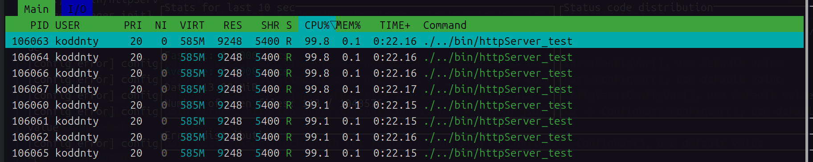

# 性能分析


## Http Get 请求服务

解析请求构建HelloWorld报文并返回

### 测试代码:

``` cpp		
#include <cstdio>
#include <memory>
#include "basic/log.h"
#include "basic/config.h"
#include "basic/address.h"
#include "server/http/httpServer.hpp"

static m_sylar::Logger::ptr g_logger = M_SYLAR_LOG_NAME("system");

m_sylar::Task<void> home_page(m_sylar::http::HttpSession::ptr session) {
    session->getResponse()->appendHeader("nihao", "110");
    std::string message = "hello world";
    session->getResponse()->setBody(message);
    co_await session->co_sendResp();
    co_return;
}


void test_http_server(m_sylar::IOManager* iom) {
    uint16_t port = 8803;
    m_sylar::http::HttpServer::ptr server(new m_sylar::http::HttpServer(iom));
    m_sylar::Address::ptr addr = m_sylar::Address::LookupAnyIPAddress("0.0.0.0");
    std::dynamic_pointer_cast<m_sylar::IPv4Address>(addr)->setPort(port);
    server->bind(addr, 6);
    
    server->GET("/home", home_page);

    server->start();
    M_SYLAR_LOG_INFO(g_logger) << "All Gate have been registered, ip:0.0.0.0:" << port;
    sleep(1000);
    server->stop();
}


int main(void) {
    std::string config_path = "/home/koddnty/user/projects/sylar/m_sylar/m_sylar/conf/basic.json";
    std::cout << "[LoggerManager init] config path: " << config_path << std::endl;
    m_sylar::ConfigManager::LoadJson(config_path, 0);

    m_sylar::IOManager iom("httpServer", 8);    
    test_http_server(&iom);
    iom.autoStop();
    return 0;
}
```


### 结果

cpu与资源占用


**oha 压测**
使用oha进行压力测试,30s 100连接情况下,本地回环请求成功率为100%.P99延迟为6ms左右.性能较为优秀.

命令输出:

```shell
╭─koddnty@koddnty-Legion-Y7000P-IRX9 ~ 
╰─$ oha -m GET -z 30s -c 100  --latency-correction http://127.0.0.1:8803/home

Summary:
  Success rate:	100.00%
  Total:	30000.9793 ms
  Slowest:	133.2243 ms
  Fastest:	0.0323 ms
  Average:	0.7607 ms
  Requests/sec:	131149.1521

  Total data:	41.27 MiB
  Size/request:	11 B
  Size/sec:	1.38 MiB

Response time histogram:
    0.032 ms [1]       |
   13.352 ms [3930240] |■■■■■■■■■■■■■■■■■■■■■■■■■■■■■■■■
   26.671 ms [4008]    |
   39.990 ms [74]      |
   53.309 ms [2]       |
   66.628 ms [100]     |
   79.948 ms [0]       |
   93.267 ms [0]       |
  106.586 ms [0]       |
  119.905 ms [0]       |
  133.224 ms [100]     |

Response time distribution:
  10.00% in 0.0432 ms
  25.00% in 0.0530 ms
  50.00% in 0.1675 ms
  75.00% in 0.9856 ms
  90.00% in 2.0562 ms
  95.00% in 2.9585 ms
  99.00% in 6.2408 ms
  99.90% in 13.6200 ms
  99.99% in 24.1184 ms


Details (average, fastest, slowest):
  DNS+dialup:	9.8949 ms, 0.2654 ms, 14.5024 ms
  DNS-lookup:	0.0134 ms, 0.0017 ms, 0.1182 ms

Status code distribution:
  [200] 3934525 responses

Error distribution:
  [78] aborted due to deadline

```